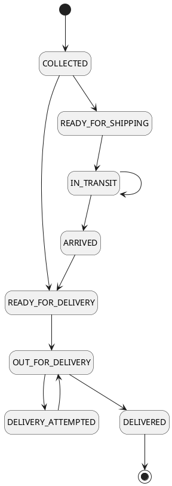

# Teleport Courier
> Courier & Package Management System

A project to demonstrate the Database Design & Application for Courier & Package Management System.
The project expose the APIs for different operations and persist the data in the Relational Database (RDBMS).

### Prerequisite
- JDK 11+ `java -version`
- MAVEN 3.8+ `mvn -v`

### Steps to execute

```bash
mvn clean package
java -jar target/courier-1.0.0.jar
```

### Useful links
- Swagger: [http://localhost:8080/swagger-ui/](http://localhost:8080/swagger-ui/)
- Database: [http://localhost:8080/h2-console/](http://localhost:8080/h2-console/)


## Consignment Status


